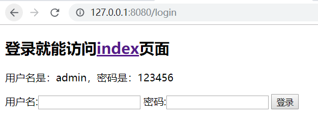

# jwt-impl
使用jwt方式实现客服端和服务端通信

## 登录页面


输入用户名密码点击登录,控制器代码，生成token返回给页面
```
//登录方法
@PostMapping("doLogin")
public HttpResult login(@RequestBody LoginData loginData){

    if (StringUtils.isEmpty(loginData.getUsername()) || StringUtils.isEmpty(loginData.getPassword()))
        return HttpResult.error("用户名或密码不能为空！！");
    if (!username.equals(loginData.getUsername()) || !password.equals(loginData.getPassword()))
        return HttpResult.error("用户名或密码错误！");

    //生成token
    String token = jwtUtils.generateToken(1);

    Map<String, Object> map = new HashMap<>();
    map.put("token", token);
    map.put("expire", jwtUtils.getExpire());
    return HttpResult.ok(map);
}

/**
 * 生成jwt token
 */
public String generateToken(long userId) {
    Date nowDate = new Date();
    //过期时间
    Date expireDate = new Date(nowDate.getTime() + expire * 1000);

    return Jwts.builder()
            .setHeaderParam("typ", "JWT")
            .setSubject(userId+"")
            .setIssuedAt(nowDate)
            .setExpiration(expireDate)
            .signWith(SignatureAlgorithm.HS512, secret)
            .compact();
}
```

页面在访问index首页时会带上服务端返回的token,服务端验证

拦截器拦截通过自定义注解@Login来验证用户token,控制实现用户认证访问功能
```
//拦截器代码
@Override
public boolean preHandle(HttpServletRequest request, HttpServletResponse response, Object handler) throws Exception {
    Login annotation;
    if(handler instanceof HandlerMethod) {
        annotation = ((HandlerMethod) handler).getMethodAnnotation(Login.class);
    } else {
        return true;
    }

    if(annotation == null){
        return true;
    }

    //获取用户凭证
    String token = request.getHeader(jwtUtils.getHeader());
    if(StringUtils.isBlank(token)){
        token = request.getParameter(jwtUtils.getHeader());
    }

    //凭证为空
    if(StringUtils.isBlank(token)){
        throw new UserException(jwtUtils.getHeader() + "不能为空", HttpStatus.UNAUTHORIZED.value());
    }

    Claims claims = jwtUtils.getClaimByToken(token);
    if(claims == null || jwtUtils.isTokenExpired(claims.getExpiration())){
        throw new UserException(jwtUtils.getHeader() + "失效，请重新登录", HttpStatus.UNAUTHORIZED.value());
    }

    //设置userId到request里，后续根据userId，获取用户信息
    request.setAttribute(USER_KEY, Long.parseLong(claims.getSubject()));

    return true;
}
    
//首页controller代码
@Login
@GetMapping("index")
public String index(){
    System.out.println("index");
    return "index";
}
```
